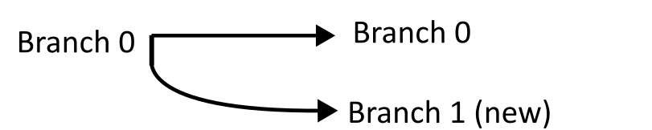
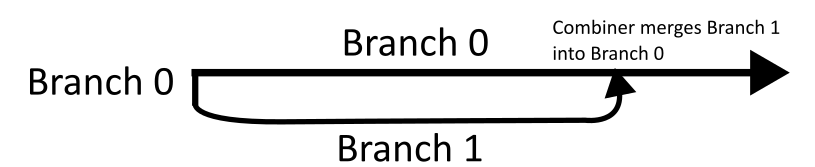
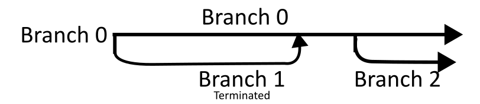

# Class and Method Documentation

Documentation for CAST's [classes](#classes).

[How to manage branches](#network-branch-rules)

## Organization of Pages

Each class documentation page is grouped into these sections:
- Constructor (how the object is created)
- Getters (retrieve the object's data)
- Setters (change the object's data)
- Methods (any other functionality that is not a getter or a setter)
- Operator Overloads (allows use of operators on the object)

Any method in a subclass that overrides a superclass method has its own documentation entry. If a superclass' virtual method is not overridden, the method is not listed in the subclass' documentation.

Most objects have a `shared_ptr_deep_copy` method, which clones the object into a new `std::shared_ptr`. The pointer references a separate object and cannot be used to modify the original.

### Format of Documentation Entry

**Method Name**

*Signature:* `method signature, including any modifiers (i.e. const, override)`

Summary of what the method does.

Additional information about the method. Includes more details about what the method does, implementation details that the user might need to know...

**Parameters**
* `param1` (`datatype`): What the parameter does. Preconditions on the parameter.  
...

**Returns**
* `return value` (`datatype`): What the return value means.

**Exceptions**
* `exception`: Conditions that cause the exception.  
...

---

## Classes

All functionality is under the `cast` namespace.

* [ActivationFunction](activation_function)
* [NetworkComponent](network_component)
* [Network](network)
* [Optimizer](optimizer)
* [Output Stream Manipulators](ostream_manip)


## Network Branch Rules

A Network object starts empty. Network components (layers, branching structure, etc.) are added one at a time to the Network object.

Network components are added to branches, which are separate paths of execution through a network.  
Each branch has a unique numerical ID. The original branch in a network has ID 0.

Operators (layers and activation functions) don't change the number of branches.

Adding a Splitter component creates additional branches, which can then be added to.

A Combiner component merges branches into the Combiner's branch. When a branch is combined, the branch's ID is never reused. Attempting to add to a merged branch results in an error.

To train and optimize, a network must have exactly one non-merged branch.

<br>

Example of branch structure creation:

```
using namespace cast;

// A new, empty network is created. Branch 0 becomes available.
Network net;

// A two-way Splitter is added to branch 0. The addition of the Splitter creates branch 1, as well as retaining branch 0.
net.add_splitter(2, 0); //2-way splitter into branch 0

/*
At this point, the network cannot be used for training and prediction. The network has multiple unterminated branches (0 and 1).
*/
```



<br>

```
Operators are added to branches 0 and 1...

// A Combiner is placed into branch 0, set to merge branch 1. Branch 1 ends at the newly added Combiner.
net.add_combiner({1}, 0); //Place a Combiner into branch 0, merging branch 1 into it

/*
Adding a component to branch 1 is no longer possible because branch 1 has ended.
*/
```



<br>

```
// A two-way Splitter is placed in branch 0. Branch 2 is created (branch 1's ID is not reused).
net.add_splitter(2, 0); //2-way splitter into branch 0
```



<br>

```
More operators are added to branches 0 and 2...

// A Combiner merges branch 2 into branch 0.
net.add_combiner({2}, 0); //Place a Combiner into branch 0, merging branch 2 into it

/*
 Now that there is only one unterminated branch, the network can be trained.
*/
```